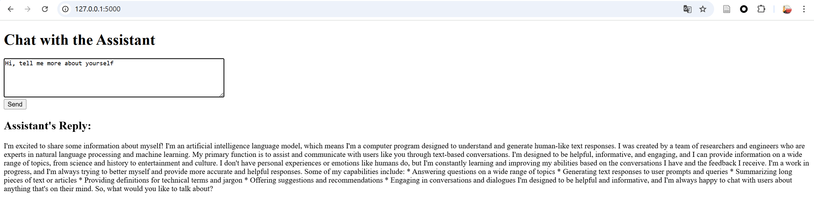
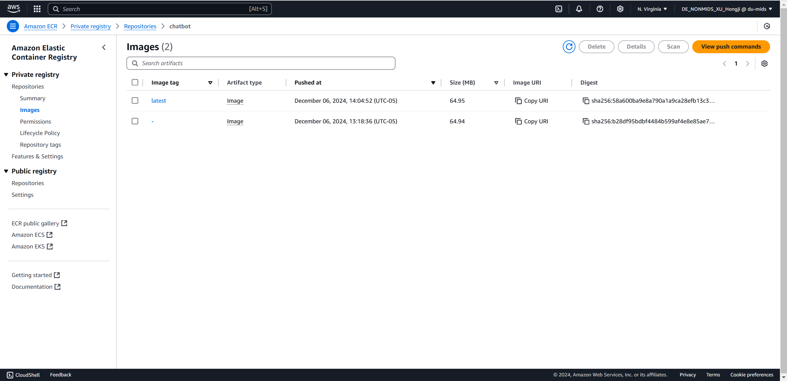
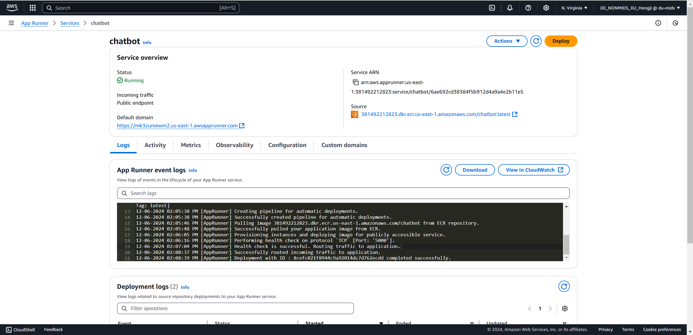
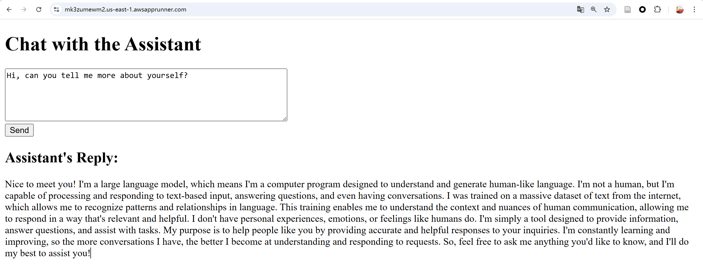

# IDS706_individual_3

## Requirement

For this assignment, you will build a publicly accessible auto-scaling container using AWS Services and Flask. This is an easy way to build and deploy a scaleable web-hosted app and will allow you to apply your Flask knowledge from previous lessons.

## Flask App

This app is designed to serve as a simple interface for a large language model, specifically utilizing the LLAMA 3B API to respond to customer inquiries. It aims to provide users with a seamless and efficient experience for obtaining accurate and contextually relevant answers to their questions. The app will act as a bridge between the powerful language model capabilities of LLAMA 3B and end-users, ensuring that interactions are intuitive, fast, and user-friendly. This functionality can be extended for various use cases such as customer support, information retrieval, or even interactive Q&A systems, depending on customer needs.

## Use of DockerHub

I am using ECR as a replacement for DockerHub.

## AWS Web App

I am using AWS App Runner to seamlessly deploy my container as a publicly accessible endpoint through the AWS Web App.

You can access the chatbot now at https://mk3zumewm2.us-east-1.awsapprunner.com/

